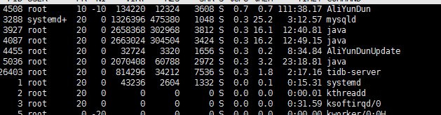

## 如何定位JAVA生产卡顿或卡死问题，如何定位解决问题

​		首先在Linux当中定位问题

​		首先查询是不是Java的问题导致的占用内存过高



```
top
```

​		那么我们查看例如4087（他只占用了0.7的CPU，但是生产的时候定位的时候肯定不是，模拟环境）

​		我们就定位到了4087他占用CPU就是这个Java进程，然后我们分析这个进程的线程

```
ps -mp 4087 -o THREAD,tid,time
```


​	我们可以看到线程的tid，我们找到例如4185这个线程，那么在内存中使用的是16进制，所以我们需要转换为16，把4185用计算器或者其他的转换为16进制，那么4185转换为16进制就是1059 ，但是在分析的时候需要使用字母必须为小写

jstack 4087 | grep 1059 -A60

然后通过进程id再跟踪线程tid进行分析

​	

这样就能找到对应的线程以及对应的类，以及错误行数了，然后进行代码的修改或者是优化