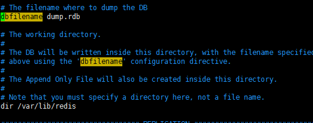

# 缓存相关

## redis和memcached的区别

​		相对于 Memcached，来说如果他断电了数

​			据也就没有了，不能像Redis一样支持数据的持久化，在这一点上Redis做的比他好，并且它包含了

​			Memcached的几乎所有的功能并且比他更加强大，作为Java来说Redis是一个不错的缓存数据库，

​			这只是Redis的一部分功能，还有更多的强大的功能，并且Memcached只支持json格式的字符串，	

​			但是Redis支持很多种数据类型，所以在现在的市场上Memcached已经逐渐被Redis取代了

​		不同点：

```
				1、支持的数据结构类型
						Memcache仅仅支持键值对，Redis支持List，Hash,Set.Zset等等
				2、数据持久化
						Memcache只支持内存，不提供持久化，数据无法恢复，Redis有Rdb，以及Aof的策略进行数据持久化
				3、过期策略
						Memcache在set时指定，Redis可以先设置后修改
```

## redis支持哪些数据结构

​		五种数据类型：

​						字符串（String）

​						哈希（hash）

​						字符串列表（list）

​						字符串集合（set）

​						有序字符串集合（zset       sorted set）

​		但是在Redis5.0中发布了新的数据类型

​			Stream data type 

## redis是单线程的么，所有的工作都是单线程么

​		Redis是单线程的，redis实际上是采用了线程封闭的观念，把任务封闭在一个线程，自然避免了线程安全问题，不过对于需要依赖多个redis操作的复合操作来说，依然需要锁，而且有可能是分布式锁。 所有的工作并不是单线程的，而是使用I/O的多路复用，

​		Redis 是跑在单线程中的，所有的操作都是按照顺序线性执行的，但是由于读写操作等待用户输入或输出都是阻塞的，所以 I/O 操作在一般情况下往往不能直接返回，这会导致某一文件的 I/O 阻塞导致整个进程无法对其它客户提供服务，而 I/O 多路复用就是为了解决这个问题而出现的 

​		那么什么是多路I/O的复用呢？		

​		多路指的是多个TCP连接，复用指一个或者多个线程进行处理，在Redis中是单线程的，简单的理解就是多个TCP连接进行数据写入的请求，通过一个单线程进行多路的IO写入，这个就是多路IO复用，但是I/O的多路复用也是有很多种模型的，常见的有select、poll、epoll。

​		而在Redis当中使用的epoll。

## redis如何存储一个String的

​		通过他的Key  Value的键值对进行存储。

## 用过 Redis 的哪些数据结构, 分别用在什么场景?

### String

```
		String类型他并不是只能存储String，也能用来存储Long，等等，他可以用来存储一些结构简单的数据，并且效率非常高，像日常的一些单个的值往里面存，例如用户的token，还有用户的信息。
```

### Hash

```
		Hash是一个字典类型，这个时候我们可以用它来存储一些需要频繁修改的对象，例如用户的积分（但一般也是在数据库中存储，Redis存储一般用来提高效率），那么我们需要对用户的积分进行改动，而且这种改动还比较频繁，那么我们可以使用Hash来进行存储这个用户对象，因为如果使用String的话他会全部的序列化出来再存储进去，这样造成的大量IO比较消耗性能。
```

### List

```
		List是一个列表，他其实是一个链表，但是更多的使用时是将他当做一个消息队列来使用，因为他可以push和pop这和Java中的Queue队列一样，我们可以使用它来做一个消息队列。
```

### Set

```
		Set是一个集合，他和Java中的Set也是一样的无序的不唯一的值，如果使用的话场景还是比较多的，例如向的好友列表，还有关注的用户，和粉丝，以及还能用来统计访问用户，比如统计某一天的用户访问量，和访问过的用户。			
```

### ZSet

```
		ZSet是一个有序的集合，他可以用来存储集合并且做一个排序，那么我们可以使用他来进行一个点赞的操作，应为他去重并且有序，通常用于一些需要频繁操作的数据，并且需要实时排名的数据我们可以考虑使用ZSet。
```

​		这几个数据类型更多的是结合实际的业务需求来进行使用的

## 缓存击穿

​		首先我们需要了解什么是缓存击穿。

​		缓存击穿是指我们在访问数据的时候加上了缓存，例如商城首页的热点数据，又或者是微博热点新闻，或者其他热点数据，我们对他进行了缓存，因为这部分的数据访问量较大，我们不能直接查询数据库，而是先从数据库中查询，然后缓存到缓存中间件或者本地中，当然这个缓存是有一个时间的，如果说这个时候刚好有很多用户来访问我们的热点数据，然后缓存刚好失效，那么这个时候就会有非常多的并发到我们的MySQL中，MySQL可能会由于请求过多崩溃或者其他异常导致不可用，这种情况下我们称之为缓存击穿。

​		简单概述：例如我们将某个商品ID缓存到Redis中，但是某一个时间点这个缓存失效了，这个时候就有大量的这个商品的请求，来查询MySQL，导致MySQL扛不住。

​		那么如何解决这个问题呢？

​		我们可以采用加锁的方式进行访问，例如多个线程只能有一个能够获取到锁对象，他去查询后，再将数据放回Redis，其他线程获取到锁之后先去查询Redis，因为被其他线程设置了，所以现在Redis是有缓存的，这样就避免了大量请求到数据库。

​		加锁：

```java
				1、synchronized							 //	单体项目中使用
				2、ReentrantLock							 //	单体项目中使用
				3、Redis锁										// 分布式项目使用
				4、Zookeeper锁								// 分布式项目使用
```

## 缓存穿透

​		缓存穿透是指我们例如商品有3000个，ID为1-3000，那么这个时候有人恶意的去攻击我们的网站，它采用-1的ID，或者是采用大于3000的ID去请求数据，那么这个时候缓存中是始终查询不到的，如果他持续的采用一些恶意的ID进行攻击，那么我们的数据库压力就会非常大。

​		简单概述：采用大部分不存在的数据进行请求，绕过缓存，造成大量数据请求数据库，导致数据库压力过大或者崩溃。

​		那么我们如何解决这个问题呢？

​		我们可以将这一步商品的ID或者说这个缓存标识符，给存储起来，也就是有效的缓存标识符，例如1-3000，我们将它存储到某一个地方，每次查询缓存前我们先查询他是不是一个有效的缓存标识符。

​		缓存标识：

```java
				1、ConcurrentHashMap或者CopyOnWriteArraySet等并发容器
          
        		我们将所有的商品ID放到并发容器中，每次查询前先访问是否存在这个ID，不存在直接返回NULL，防止缓存击穿。
          	缺点：分布式情况实现不方便，需要结合发布订阅或者其他分布式同步ID（后续新增的商品ID）
          
				2、Redis布隆过滤器
          
          	将所有的商品ID都存放到布隆过滤器当中，每次查询缓存时先走一下布隆过滤器，如果不存在那么直接返回NULL。
```

## 缓存雪崩

​		缓存雪崩是指我们在某一个时间中，大量的缓存失效，例如1-3000这3000个商品，有2000多个缓存在同一时间失效了，那么我们就需要查询两千个商品，以及争抢锁资源，并且随着大量用户的请求，引起缓存的雪崩。

​		简单概述：同一时间点多个缓存失效，导致大量请求访问数据库，引起缓存雪崩

​		那么我们如何解决这个方案呢?

​		我们就只能在设置缓存的超时时间时，动态随机的设置超时时间，或者设置不规律的超时时间，让我们的缓存不会大量的在同一个时间点失效。

## redis持久化策略

### RDB

​		RDB的存储方式：在指定的时间间隔内将内存中的数据集快照写入磁盘，也
​				就是行话讲的Snapshot快照，它恢复时是将快照文件直接读到内存里

​		Redis会单独创建（fork）一个子进程来进行持久化，会先将数据写入
​		到一个临时文件中，待持久化过程都结束了，再用这个临时文件替换
​		上次持久化好的文件。整个过程中，主进程是不进行任何IO操作的，
​		这就确保了极高的性能如果需要进行大规模数据的恢复，且对于数据
​		恢复的完整性不是非常敏感，那RDB方式要比AOF方式更加的高效。
​		RDB的缺点是最后一次持久化后的数据可能丢失

​		rdb的保存的文件： 在redis.conf中配置文件名称，默认为dump.rdb

​		

​		下面就是他的持久化的文件存储的路径

​		RDB持久化的保存策略

​		这是他的保存策略，如果60秒内发生了10000次数据操作则进行一次存储，

​		如果300秒发生了10次则会存入一次。如果900秒内发生了一次操作那么900秒后

​		就会备份一次，

​		

​		stop-writes-on-bgsave-error yes
​		当Redis无法写入磁盘的话，直接关掉Redis的写操作

​		rdbcompression yes
​		进行rdb保存时，将文件压缩

​		rdbchecksum yes
​		在存储快照后，还可以让Redis使用CRC64算法来进行数
​		据校验，但是这样做会增加大约10%的性能消耗，如果希
​		望获取到最大的性能提升，可以关闭此功能

​	rdb的备份

​					先通过config get dir 查询rdb文件的目录
​					将*.rdb的文件拷贝到别的地方

​			 	rdb的恢复

​			 		先把备份的文件拷贝到工作目录下
​		 			关闭Redis
​		 			启动Redis, 备份数据会直接加载

​				注：清先看清楚配置文件的RDB的文件名和路径

​	优点：

​					 节省磁盘空间
 					 恢复速度快

​	rdb的缺点

​					虽然Redis在fork时使用了写时拷贝技术,

​					但是如果数据庞大时还是比较消耗性能


​					在备份周期在一定间隔时间做一次备份，所以如果
​					Redis意外down掉的话，就会丢失最后一次快照后的所有修改	

### AOF

​	 AOF默认不开启，需要手动在配置文件中配置

​			 可以在redis.conf中配置文件名称，默认为 appendonly.aof

​			

​		这分别是是否开启。默认是关闭的而RDB默认是开启的，他的路径和RDB是一样的

​		下面这个就是文件名了

​		那么如果RDB好AOF同时启动的话他会执行哪个呢？

​			AOF的备份机制和性能虽然和RDB不同, 但是备份和
​			恢复的操作同RDB一样，都是拷贝备份文件，需要
​			恢复时再拷贝到Redis工作目录下，启动系统即加载

​			**AOF和RDB同时开启，系统默认取AOF的数据**

​		持久化AOF

​			 AOF文件的保存路径，同RDB的路径一致

​			 如遇到AOF文件损坏，可通过
​				redis-check-aof --fix appendonly.aof 进行恢复

​		AOF优点：

​				恢复数据全，不会丢失数据

​		缺点：

​				占用磁盘空间较大，并且恢复没有RDB快，并且影响性能

- 如果只配置AOF，重启时加载AOF文件恢复数据；
- 如果同时配置了RBD和AOF，启动是只加载AOF文件恢复数据;
- 如果只配置RBD，启动时将加载dump文件恢复数据。


## 知道动态字符串sds么？

​		动态字符串（simple dynamic string）

​		首先我们需要了解什么是sds动态字符串

​		我们知道Redis是采用C语言进行编写的，而所有的Key键都是字符串String类型，以及我们的很多的Value也会存储字符串，那么我们就要首先了解C语言的字符串了。

​		C语言中是没有String这个字符串类型的，而是采用的一个char数组，然后以\0作为一个结束符

```java
		// C语言中的字符串
		char *str;
    str = "redis";
		printf("%s",str);

		// 但是实际上这个str在转成String字符串的时候底层的char数组被转了,后面会多出一个/0的字符串结束符
		char str[5] = {'r','e','d','i','s','\0'};
```

​		那么我们在获取字符串的长度的时候，我们就会发现一个问题，我们需要遍历这个char数组，获取长度的时间复杂度是O(N)。

​		并且我们还会发现一个问题，我们存储二进制的时候，如果说二进制流中出现\0的时候，就会出现问题。

​		使用C字符串数组有以下问题

```properties
			1: 字符串数组的长度都是固定的，并且我们追加或者修改字符串数组相当于都是在重新创建内存空间，损耗内存
			2: 获取字符串长度时需要遍历字符串数组，时间复杂度较高，大量查询长度，会引起性能问题
			3: 存储二进制数据时，例如文件等等我们使用\0判断是否结尾，会导致二进制数据存储、查询长度、获取数据时引发的一系列问题
```

​		总体上来说则使用C语言转换后的String并不适合Redis用来存储，那么针对字符串的Key我们怎么去解决呢？

​		答案就是：动态字符串（simple dynamic string）SDS

​				那么SDS能帮助我们解决什么问题呢？，如下 : 

```properties
			1: SDS在字符串发生扩容的时候直接使用空闲的空间进行扩容，不需要重新分配数组对象，从而解决扩容问题
			2: 在SDS的内部定义了字符串的长度，使用时可以直接获取,将时间复杂度从O(n)变成了O(1)提高了长度查询效率
			3: SDS的空间预分配是惰性释放内存的，从而减少分配内存的次数
			4: SDS中存储了字符串的长度信息，我们可以直接根据起始位置，找到长度，获取数据，从而避免了二进制所导致问题
```

​		下面是SDS所存储的数据（老版本SDS >= 3.0）：

```c
struct sdshr{
  int len;  // 用于记录已使用数组长度，存储的字符串数据在buffer数组中的长度
  int free; // 用于记录数组剩余空间，用于追加时扩容是否需要扩容buffer
  char buf[];// 用于创建内存空间，以及存储的数据字符串buff数组
}
```

​		但其实这个buffer数组也是采用的\0进行存储的，那么为什么还要加上这个\0呢，答案就是为了兼容某些C的类库，所以还是需要\0进行结尾。

​		SDS空间分配策略：

- ​		**预留空间**

```java
		// 预留空间，是如何预留的呢？
					我们举例示范，例如 我们新建了一个字符串"redis",
          
					现在Buffer的长度是20
          char buf[20] = {'r','e','d','i','s','\0',.....空};

          那么此时的SDS如下
					struct sdshr{
            int len = 5;
            int free = 14;
            char buf[] = {'r','e','d','i','s','\0',.....空};
          }

					我们现在需要给他追加5.0.3这个字符串
          append("5.0.3");
					如果是采用来的字符串数组那么,则是
          char str[] = {'r','e','d','i','s','\0'};
					我们还需要将两个字符串的长度进行计算，然后创建一个新的字符串数组，再把值给添加进去
					而使用SDS我们就可以直接根据len找到数组的位置然后进行插入，也不需要创建新的数组对象
            															len
          																 |
            															 v
          char buf[] = {'r','e','d','i','s','\0',.....空};
```

- ​		**惰性空间释放**

```java
		// 惰性空间释放，是如何惰性空间释放的呢？
					还是以上面的示例
          
          我们将redis修改为key
          那么这个时候
          struct sdshr{
            int len = 3;
            int free = 16;
            char buf[] = {'k','e','y','\0',.....空};
          }

					我们可以看到buffer数组的长度还是没有变，我们下一次再插入一个redis5.0.3的时候是不会再创建内存空间的。
          这个时候我们数组长度还是20，那么再次修改的话我们的buffer数组不需要重新创建内存空间了。
          		缺点：
            			如果字符串占用较小的话只会修改free，占用内存空间，不立即释放
            			但是Redis作为一个内存缓存中间件来说的话，只要性能高，是可以牺牲一部分内存的
```

​		新版本的SDS,在SDS >= 4.0的版本源码如下：[点击进入](https://github.com/redis/redis/blob/unstable/src/sds.h)

```c
/* 注意： sdshdr5 从未使用过， 我们只是直接访问标志字节.
 * 但是，这里记录类型 5 SDS 字符串的布局. */
struct __attribute__ ((__packed__)) sdshdr5 {
    unsigned char flags; /*3 lsb 的类型，和 5 msb 的字符串长度 */
    char buf[];
};
struct __attribute__ ((__packed__)) sdshdr8 {
    uint8_t len; /* 已经使用的长度 */
    uint8_t alloc; /* 排除掉Header以及null之后的可分配空间 */
    unsigned char flags; /* 3 lsb类型，5个未使用位 */
    char buf[];
};
struct __attribute__ ((__packed__)) sdshdr16 {
    uint16_t len; /* used */
    uint16_t alloc; /* excluding the header and null terminator */
    unsigned char flags; /* 3 lsb of type, 5 unused bits */
    char buf[];
};
struct __attribute__ ((__packed__)) sdshdr32 {
    uint32_t len; /* used */
    uint32_t alloc; /* excluding the header and null terminator */
    unsigned char flags; /* 3 lsb of type, 5 unused bits */
    char buf[];
};
struct __attribute__ ((__packed__)) sdshdr64 {
    uint64_t len; /* used */
    uint64_t alloc; /* excluding the header and null terminator */
    unsigned char flags; /* 3 lsb of type, 5 unused bits */
    char buf[];
};
```


## 集群主节点挂掉了怎么办

​		在Redis的Cluster集群模式下，我们以3主3从为示例，那么当其中的一个分片的Master宕掉了之后，那么Redis集群将会进行选举，选举条件为，存活Master节点  > 总Master节点 / 2。

​		还是三主三从为示例：

​				挂掉一台Master条件为：2 > 3 / 2 = true

​				挂掉两台Master条件为：1 > 3 / 2 = false

​		所以如果挂掉了两台Master之后，这两个Master的分片就无法使用了（注意：不是整个集群不可用）。

​		所以当集群中的某一个Master挂掉以后则会进行选举，当选举条件符合时，其他Master则会选举出新的从节点为Master，等原来的Master上线以后则降为Slave从节点。

## 集群脑裂问题

​		首先我们需要了解什么是脑裂问题，我们以1主2从一哨兵举例。

​		由于网络等原因出现分区，导致原来的Master没有挂，但是哨兵访问不到Master了，这个时候他认为Master挂掉了，从下面的从节点选举出新的Master节点，那么这个时候因为我们原来的Master没有挂，还有数据持续的往里面写入，这个时候旧Master写入了很多的数据了，现在网络突然又好了，导致原来的旧Master降级为从节点，再从新的从节点同步数据，这个时候就导致我们写的数据丢失的问题，也就是所谓的脑裂。

​		那么如何解决这个问题呢？

​		其实和我们的Elasticsearch差不多，但是Es是设置Master节点数，而Redis是设置从节点数。

​		我们可以修改Redis的配置文件防止脑裂问题

```java
　　　　（旧版本）
　　　　　　min-slaves-to-write 1			 // 如果存活的Slave小于1就不写入数据
　　　　　　min-slaves-max-lag 10			 // 主从复制的延迟不能超过的秒数
　　　　（新版本 >= 5.0）
　　　　　　min-replicas-to-write 1		 // 如果存活的Slave小于1就不写入数据
　　　　　　min-replicas-max-lag 10		 // 主从复制的延迟不能超过的秒数
```

## 你们用了redis，redis的底层数据结构了解多少？

​		简单动态字符串				官方源码：[点击进入](https://github.com/redis/redis/blob/unstable/src/sds.h)

​		链表									

​		字典									官方源码：[点击进入](https://github.com/redis/redis/blob/unstable/src/dict.h)

​		跳跃表							

​		整数集合

​		压缩列表

## Redis的数据是如何存储的？

​		**字典**是Redis最基础的数据结构，一个字典即一个DB，Redis支持多DB，例如，16个数据库就对应16个字典，

## Redis如果出现Key的哈希碰撞怎么办？

​		**Redis字典采用Hash表实现**，针对碰撞问题，采用的方法为“链地址法”，也就是链表+引用，例如某两个Key的Hash都一样，例如都是3，那么这个3存储的不是K和V，而是一个Key的引用，当发生冲突了的时候我们找到3，然后根据3找到这个饮用，如果这个Key对应，那么久取出他的值，如果不是这个Key，我们找到他的next，他指向下一个节点，我们再找到这个下一个节点他也同样有一个next指针，这样就解决了Hash碰撞的问题。

​		点击查看Redis字典源码：[点击进入](https://github.com/redis/redis/blob/unstable/src/dict.h)

​		字典Entry元素的定义如下

```c
typedef struct dictEntry {
  	// Key
    void *key;
    union {
        void *val;
        uint64_t u64;
        int64_t s64;
        double d;
    } v; // Value
  	// next指针指向下一个节点
    struct dictEntry *next;
} dictEntry;
```

​		那么如果产生大量的Hash碰撞的话就会将这个Hash表退化成链表，这种情况我们怎么解决呢？Redis的方案是“双buffer”，正常流程使用一个buffer，当发现碰撞剧烈（判断依据为当前槽位数和Key数的对比），分配一个更大的buffer，然后逐步将数据从老的buffer迁移到新的buffer。

​		如下是C源码中对于

```c
dictEntry *dictAddRaw(dict *d, void *key, dictEntry **existing)
{
    long index;
    dictEntry *entry;
    dictht *ht;

    if (dictIsRehashing(d)) _dictRehashStep(d);

    /* Get the index of the new element, or -1 if
     * the element already exists. */
    if ((index = _dictKeyIndex(d, key, dictHashKey(d,key), existing)) == -1)
        return NULL;

    /* Allocate the memory and store the new entry.
     * Insert the element in top, with the assumption that in a database
     * system it is more likely that recently added entries are accessed
     * more frequently. */
    ht = dictIsRehashing(d) ? &d->ht[1] : &d->ht[0];
    entry = zmalloc(sizeof(*entry));
    entry->next = ht->table[index];
    ht->table[index] = entry;
    ht->used++;

    /* Set the hash entry fields. */
    dictSetKey(d, entry, key);
    return entry;
}
```

​		也就是我们的扩容。

## 一个key值如何在redis集群中找到存储在哪里

​		一个 Redis 集群包含 16384 个插槽（hash slot）， 数据库中的每个键都属于这 16384 个插槽的其中一个， 集群使用公式 CRC16(key)% 16384 来计算键 key 属于哪个槽， 其中 CRC16(key) 语句用于计算键 key 的 CRC16 校验和 。 集群中的每个节点负责处理一部分插槽。 举个例子， 如果一个集群可以有主节点， 其中：
​				节点 A 负责处理 0 号至 5500 号插槽。
​				节点 B 负责处理 5501 号至 11000 号插槽。
​				节点 C 负责处理 11001 号至 16383 号插槽。

​		那么redis如果有3个节点，就会根据他的key进行计算key的CRC16的值然后来对16384 进行取模的操作

​		也就是（Key 计算后的CRC16    %     16384），然后再计算取模后的值在哪一个节点中，例如取模后是3000，那么他就会找到3000的这个槽，3000的这个槽是在A节点（1-5500）（假设为3个节点），那么他就会在第一个节点进行存储，如果查找的话也会去第一个节点进行查询。

## redis的单线程特性有什么优缺点？

优点：	

- ​			代码更清晰，处理逻辑更简单
- ​			不用去考虑各种锁的问题，不存在加锁释放锁操作，没有因为可能出现死锁而导致的性能消耗
- ​			不存在多进程或者多线程导致的切换而消耗CPU

缺点：

- ​			无法发挥多核CPU性能，不过可以通过在单机开多个Redis实例来完善；

## Redis分布式锁以及注意事项

​		在使用Redis的锁的时候我们有非常多的注意事项，因为很有可能由于我们加锁的问题所引起的系统故障，主要的注意事项如下（大部分需要注意的事项，不是所有）：

​		1、setnx和expire的非原子性

​				在我们的业务场景中使用分布式锁，我们通常来说会去setnx来确定这个key是否存在，然后去设置他的超时时间，防止锁一直存在导致其他锁对象无法获取锁，但是这样是有问题的：

```sh
setnx
# 保存
不执行expire
```

​				那么我们刚刚setnx成功设置了锁，但是我们在要进行设置时间的时候抛出了异常，导致无法添加超时时间，其他的锁对象尝试获取锁一直获取不到导致程序线程请求累计，引起系统故障。

​				解决方案：

```sh
# 我们需要将设置值以及设置超时时间放到一起
# 在Redis2.6.12以上版本我们可以直接使用set将setnx和expire同时设置了如下所示
首先我们设置 一个key为lock的键然后他的值为1，然后超时时间两秒，设置类型为NX，那么这个相当于将setnx和expire一起设置了，这是一个原子性的操作
set lock 1 ex 2 NX
# 对于相应的API中，SpringDataRedis2.0以后也提供了相应的API去支持
```

​		2、解锁超时误解锁误删问题

​				那么在我们的设置锁的时候打个比方，我们有三个线程去获取锁，第一个线程去拿到锁，他将这个锁的超时时间设置成了2秒，那么我第二个线程进来没有获取到锁，进行等待，第一个锁还在执行中，2秒了他没有释放锁，但是这个锁过期了，我现在第二个锁获取到了这个锁，突然在这个时候，第一个锁执行完了，他来解锁了，实际上是我们的第二个锁的锁，第一个锁执行完后会直接将锁删除掉，那么第三个锁就开始执行了，这个时候我们的第二个锁和第三个锁是一起执行的，这样就导致了锁不住，以及锁误删的问题。

```sh
# 假设3个锁
		1、锁1获取锁执行程序
		2、锁1超时时间为2秒，但是2秒之后还没有执行完，这个锁已经超时了
		3、锁2获取锁，由于锁1超时所以可以拿到锁对象
		4、锁2拿到了锁对象，但是锁1执行完了代码，现在锁1要解锁了，把锁删掉了
		5、锁3笑咪咪的拿到了锁对象，此时锁2还在执行，这样就造成了锁1和锁2在同时执行，锁2和锁3也是同时执行的
```

​				解决方案：我们在set的时候将值设置为任务Id或者其他的唯一表示，在解锁的时候我们将设置的值和我们的id进行比较，如果这个锁是我们的我们进行解锁；

​				建议使用Lua脚本进行解锁，如果在代码中先Get然后判断值删除锁，有可能出现get的时候锁失效，然后还是误删的问题。

​				这里我们使用Lua脚本来进行删除，首先我们先获取这个KEY，然后根据这个KEY的值和传入的值进行比较，如何一样那么我们则删除原来的key，如果不一样则直接返回0即可。

​			首选我们先添加一个Key值为test

```sh
set test "test"
```

​			然后我们执行下面的代码，第一次执行我们会发现我们删除了，在执行一次则返回0

```sh
eval "if redis.call('get',KEYS[1]) == ARGV[1] then
        return redis.call('del',KEYS[1])
else
        return 0
end" 1 test "test"
```

​			3、master宕机丢锁问题

​					假设我们现在有两个线程去获取这个锁对象，我们假设他是锁1和锁2，那么首先我们进行模拟操作，锁1获取锁对象，在锁1获取到了锁对象之后，突然Master节点宕机，此时切换到丛节点，但是锁1的锁对象数据没有及时的同步到我们的锁2，那么这个时候锁1还在执行，锁2又来尝试获取锁对象，在这个时候由于从节点没有同步到Master的数据，那么锁2尝试从丛节点获取锁对象，这个时候是能够获取到的，那么就相当于这个时间我们的锁1和锁2都获取到了锁对象，这样就造成了锁不住，这也就是Master宕机丢锁的问题。

​					下面是执行的流程：

```sh
# 假设锁1和锁2，以及master和slave：
		1、首先锁1尝试获取锁对象，成功获得锁对象
		2、slave还没有从master同步数据，此时master挂掉了
		3、这个锁对象无法从master获取锁，切换到从节点
		4、锁2尝试获取锁对象，由于master宕机从节点无法同步到锁数据，锁2也成功获得锁对象
		5、引起锁问题，例如第二小节的锁误删问题，锁1执行完进行删锁，导致后面连续的锁对象混乱问题
```

​					解决方案：	

```
1、参考考虑下方的RedLock红锁机制进行实现，防止master宕机导致丢锁
2、使用其他的分布式锁方案进行解决，如Zookeeper或者MySQL（不推荐，Zk和MySQL的性能相比于Redis还是有一定的差距）
```

​		目前比较主流的分布式锁还是采用Redisson，帮助我们实现的Redis分布式锁功能较为完全以及强大。

## RedLock红锁

​			首先，我们需要知道什么是RedLock红锁，由于在我们分布式场景下经常使用分布式锁，Redis作者antirez基于分布式环境下提出了一种更高级的分布式锁的实现方式。

​			为什么需要使用RedLock算法，因为我们在单Redis实例实现分布式锁的时候如果写入锁到Master，在这个过程中Master挂掉了，然后

​			RedLock概念：假设我们具有多个Redis节点，

## 项目中有用到过布隆过滤器么？在哪些场景使用的

​			首先我们需要先了解什么是布隆过滤器，布隆过滤器（Bloom Filter）是由Howard Bloom在1970年提出的一种比较巧妙的概率型数据结构，它可以告诉你某种东西**一定不存在**或者**可能存在**。当布隆过滤器说，某种东西存在时，这种东西可能不存在；当布隆过滤器说，某种东西不存在时，那么这种东西一定不存在。

​			布隆过滤器相对于Set、Map 等数据结构来说，它可以更高效地插入和查询，并且占用空间更少，它也有缺点，就是判断某种东西是否存在时，可能会被误判。但是只要参数设置的合理，它的精确度也可以控制的相对精确，只会有小小的误判概率。

​			 那么从上方的描述中我们可以总结出来几个比较重要的点：

```
					1、布隆过滤器是一种数据结构
					2、布隆过滤器说他存在时有可能不存在，说他不存在时一定不存在
					3、它可以更高效地插入和查询，并且占用的空间少
```

​			那么我们的布隆过滤器可以用在哪些场景下进行使用呢？

​						例如，防止缓存击穿、爬虫Url去重，过滤黑名单请求，

## redis缓存给了多大的内存，命中率有多高抗住了多少QPS


## 超大Value打满网卡的问题如何规避这样的问题


## 你过往的工作经历中，是否出现过缓存集群事故，说说细并说说高可用的保障的方案

